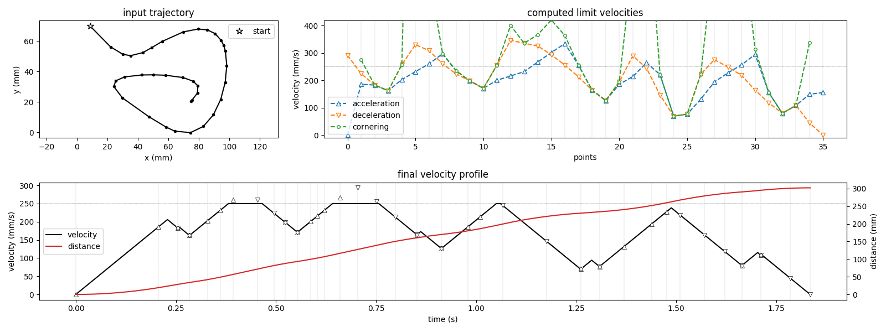

# Axidraw control

Python 3 module to interface with the [AxiDraw Drawing Machine](https://www.axidraw.com/) from Evil Mad Scientist.

## Hardware abstraction

The `EBB` class (`ebb.py`) abstracts the communications with the [EiBotBoard](http://evil-mad.github.io/EggBot/ebb.html)
by handling the serial I/O details.

The `Axidraw` class (`axidraw.py`) provides a higher level interface to the Axidraw machine.
It exposes methods to raise and lower the pen, move it along a trajectory (sequence of points), ...
This class handles hardware-related details such as conversion from physical drawing coordinates to motor steps and
basic state tracking.

## Motion planning

The Axidraw not being able to break the laws of physics, motion planning is needed to be able to perform pen movements.
We use a simple constant acceleration model to go from a trajectory (sequence of `(x,y)` points)
to a velocity profile (sequence of `(time,velocity,distance)` points) that conforms to constraints of maximum velocity, acceleration/deceleration rates, and cornering tolerance.

