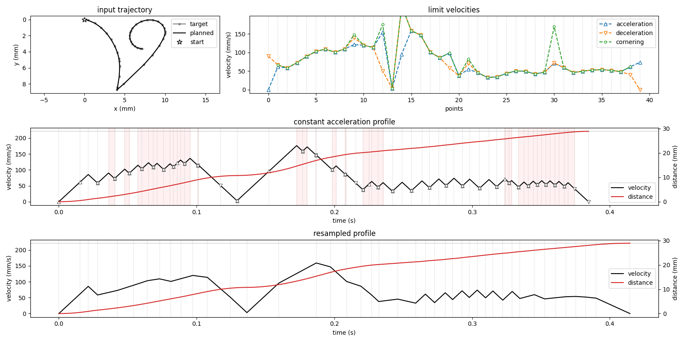
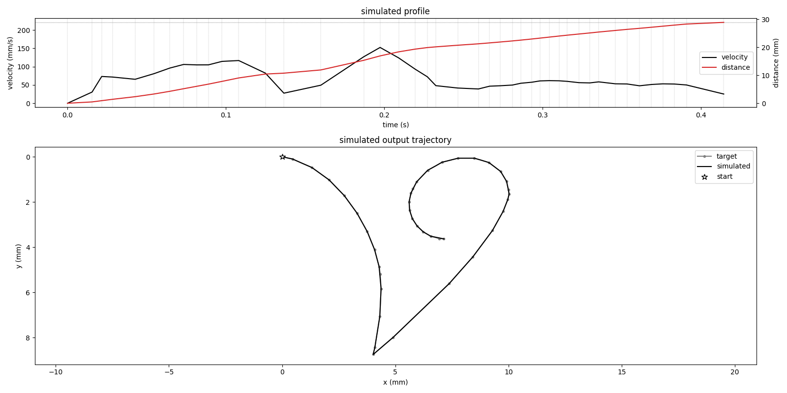

# Axidraw control

Python module to interface with the [AxiDraw Drawing Machine](https://www.axidraw.com/) from Evil Mad Scientist.

## Hardware abstraction

The `ebb` submodule provide functions to convert commands from `bytes` to `tuple` sequences,
as well as a `SerialEbb` class that abstracts the communications with the [EiBotBoard](http://evil-mad.github.io/EggBot/ebb.html)
by handling the serial I/O details.

The `CommandsBuilder` class from the `axidraw` submodule provides a higher level interface to the Axidraw machine.
It exposes methods generating EBB commands to raise and lower the pen to a specific height, move it along a trajectory, etc.
This class handles hardware-related details such as
motion planning (see below),
conversion from physical drawing coordinates to motor steps,
and basic state tracking.

The `plotter` submodule provides a `do_plot` function that can manage the transmission and execution of a command stream by the AxiDraw machine.
Using a simulation of the hardware state this function can:
- provide estimates of the progress and remaining time to completion of the commands
- inject commands to pause/resume using the button on the machine
- optimize the transmission of the commands by batching them into meaningful groups (send a whole pen move sequence at once) and disabling responses when possible

## Motion planning

The Axidraw not being able to break the laws of physics, motion planning is needed to be able to perform pen movements.
We start with a simple constant acceleration model to go from a trajectory (sequence of `(x,y)` points)
to a velocity profile (sequence of `(time,velocity,distance)` waypoints) that conforms to constraints of maximum velocity, acceleration/deceleration rates, and cornering tolerance.
This ideal profile is then adaptively resampled to smooth out high frequency velocity changes that have been empirically shown to cause jerky motion on the AxiDraw.

